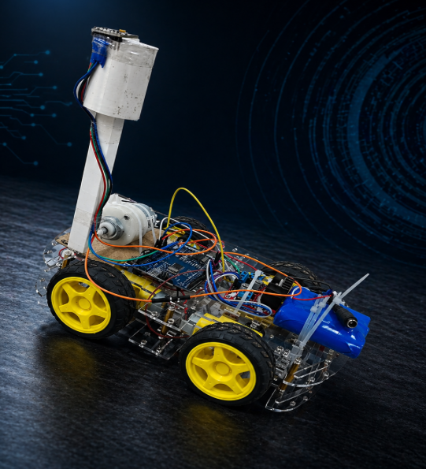
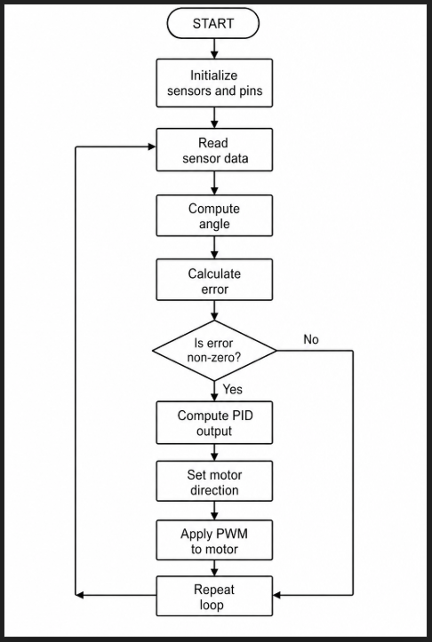

# Robotics-ControlSystem

  

This project implements a PID-controlled inverted pendulum using an MPU6050 sensor for angle estimation. Accelerometer and gyroscope data are fused to compute tilt, compared with a setpoint, and corrected using PID output. The motor driver adjusts direction and speed via PWM, enabling continuous feedback control to stabilize the system. 

# Features 
Real-time angle estimation (MPU6050) 
Complementary filter for stability 
PID control (Kp, Ki, Kd tuning) 
PWM motor control 
Direction control using driver 
Continuous feedback loop 
# Hardware Required 
Arduino (Uno) 
MPU6050 Sensor 
Motor Driver (L298N) 
DC Motor 
Power Supply 
Connecting wires 
# Working Principle 
Sensor reads tilt angle 
Complementary filter calculates stable angle 
Error = Setpoint − Angle 
PID computes correction 
Motor adjusts position 
# Control Algorithm 
The flowchart: 

  

# Circuit Connections 
1.MPU(Gyroscope)->Ardiuno 
SDA->SDA 
SCL->SCL 
VCC->5V 
GND->GND 

2.Ardiuno->Motor Driver
GND->GND  
5V->5V 
PWM pin (in our case its A9)->ENA 
Direction pin1 (in our case its A8)->IN1 
Direction pin1 (in our case its A7)->IN2 

3.Motor Driver->Motor 
OUT1->Terminal1 
OOT2->Terminal2 

# How to Run  
Upload code to Arduino 
Connect hardware properly 
Open Serial Monitor 
Tune Kp, Ki, Kd 

# Demo
🎥 Demo Video: [Watch Here]([https://drive.google.com/your-link](https://drive.google.com/file/d/131b9_4uZ-IpVv0CsWT5Alv41JCA6dMJ3/view?usp=sharing))
